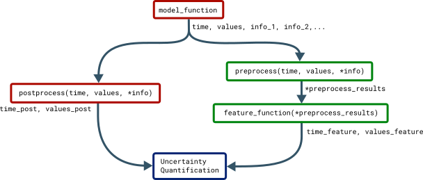

.. _main_features:

Features
========

The ``Features`` class is used when creating custom features.
Additionally it contains all common methods used by all features.
The most common arguments to ``Features`` are:::

    list_of_feature_functions = [example_feature]

    features = un.Features(new_features=list_of_feature_functions,
                           features_to_run=["example_feature"],
                           preprocess=example_preprocess,
                           adaptive=["example_feature"])

``new_features`` is a list of Python functions that each calculates a
specific feature,
whereas ``features_to_run`` tells which of the features to
perform uncertainty quantification of.
If nothing is specified, the uncertainty quantification is by default performed
on all features (``features_to_run="all"``).
:py:meth:`~uncertainpy.features.Features.preprocess` requires a Python function
that performs common calculations for all features.
``adaptive`` is a list of features that have adaptive time steps.
As with models,
Uncertainpy automatically interpolates the output of adaptive features
to a regular form.
Below we first go into details on the requirements of a feature function,
and then the requirements of a ``preprocess`` function.

Feature functions
-----------------

A specific feature is given as a Python function.
The outline of such a feature function is:::

    def example_feature(time, values, info):
        # Calculate the feature using time, values and info.

        # Return the feature times and values.
        return time_feature, values_feature

Feature functions have the following requirements:

1. **Input.**
   The feature function takes the objects returned by the
   model function as input, except in the case when a
   ``preprocess`` function is used (see below).
   In that case, the feature function instead takes
   the objects returned by the ``preprocess`` function as input
   ``preprocess`` is normally not used.

2. **Feature calculation.**
   The feature function calculates the value of a feature from the data
   given in ``time``, ``values`` and optional
   ``info`` objects.
   As previously mentioned, in all built-in features in Uncertainpy,
   ``info`` is a dictionary containing required
   information as key-value pairs.

3. **Output.**
   The feature function must return two objects:

   1. **Feature time** (``time_feature``).
      The time (or equivalent) of the feature.
      We can return ``None`` instead for features where it
      is not relevant.

   2. **Feature values** (``values_feature``).
      The result of the feature calculation.
      As for the model output,
      the feature results must be regular,
      or able to be interpolated.
      If there are no feature results for a specific model evaluation
      (e.g., if the feature was spike width and there was no spike),
      the feature function can return ``None``.
      The specific feature evaluation is then discarded in the
      uncertainty calculations.

As with models,
we can as a shortcut give a list of feature functions as the
``feature`` argument in ``UncertaintyQuantification``,
instead of first having to create a ``Features`` instance.

Feature preprocessing
---------------------

Some of the calculations needed to quantify features may overlap between
different features.
One example is finding the spike times from a voltage trace.
The ``preprocess`` function is used to avoid having to perform the
same calculations several times.
An example outline of a ``preprocess`` function is:::

    def preprocess(time, values, info):
        # Perform all common feature calculations using time,
        # values, and info returned by the model function.

        # Return the preprocessed model output and info.
        return time_preprocessed, values_preprocessed, info

The requirements for a ``preprocess`` function are:

1. **Input.**
   A ``preprocess`` function takes the objects returned by the
   model function as input.

2. **Preprocesssing.**
   The model output ``time``, ``values``,
   and additional ``info`` objects are used to
   perform all preprocess calculations.

3. **Output.**
   The ``preprocess`` function can return any number of objects
   as output.
   The returned preprocess objects are used as input arguments to the
   feature functions,
   so the two must be compatible.

This figure illustrates how the objects returned by the model function
are passed to ``preprocess``,
and the returned preprocess objects are used as input arguments in all
feature functions.
Functions associated with the model are in red while functions
associated with features are in green.
The preprocessing makes it so feature functions have different required input
arguments depending on the feature class they are added to.
As mentioned earlier,
Uncertainpy comes with three built-in feature classes.
These classes all take the ``new_features`` argument,
so custom features can be added to each set of features.
These feature classes perform a preprocessing, and therefore have different
requirements for the input arguments of new feature functions.
Additionally, certain features require specific keys to be present in the
``info`` dictionary.
Each class has a ``reference_feature`` method that states
the requirements for feature functions of that class in its docstring.

API Reference
-------------

.. autoclass:: uncertainpy.features.Features
   :members:
   :inherited-members: